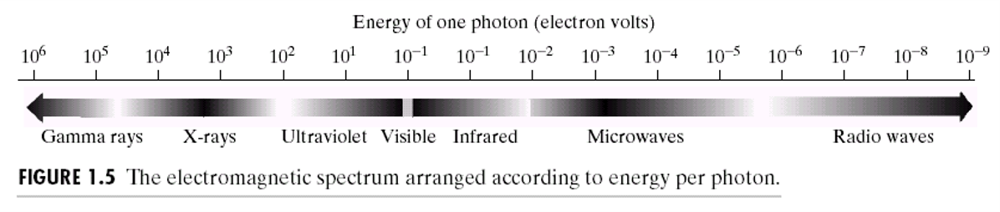
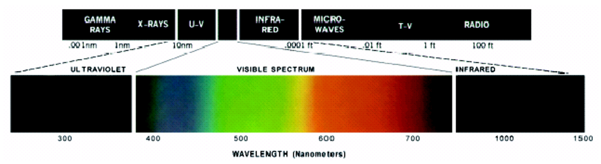
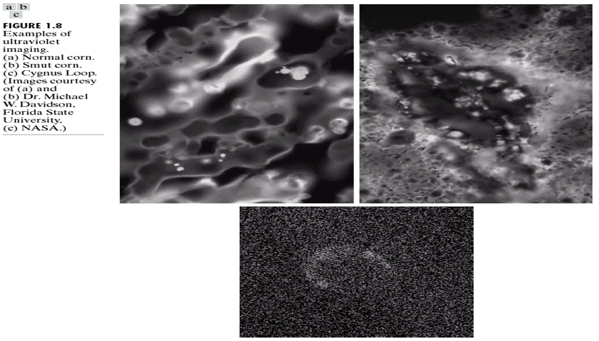

# 📘  1.4: The Electromagnetic Spectrum

## 🎥 Video
[Watch on YouTube](https://youtu.be/pj_ya0e20vE?si=lHpmGdUZCMPEmUHr)

The electromagnetic spectrum includes all types of electromagnetic radiation. In image processing, different parts of the spectrum are used (e.g., X-ray, IR).

## 🌈 Spectrum Range
- Gamma rays
- X-rays
- UV
- Visible
- Infrared
- Microwave
- Radio

---

---

---

 

---
