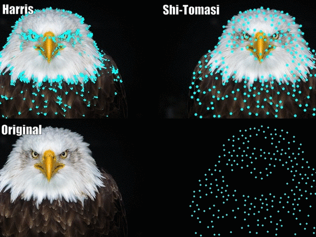

# 11.1 – Harris and Shi-Tomasi Corner Detection

<video width="800" height="410" controls>
    <source src="photo/ShiTomasiCorner.mp4" type="video/mp4">
    Your browser does not support the video tag.
  </video

---

### 🔍 Overview

Corner detection is a foundational step in many vision tasks like motion tracking, object detection, and recognition. Two widely used algorithms are:
- **Harris Corner Detector**
- **Shi-Tomasi Corner Detector (Good Features to Track)**

---

## 📐 Mathematical 

### Harris Corner Detection
The Harris corner measure is based on the eigenvalues of the **structure tensor matrix** `M` of the image gradients:
```
M = [Ix^2   IxIy]
    [IxIy   Iy^2]
```
Corner response:
```
R = det(M) - k * (trace(M))^2
```
- `det(M) = λ1 * λ2`
- `trace(M) = λ1 + λ2`
- `k` is typically 0.04 to 0.06

### Shi-Tomasi Corner Detection
Instead of using the determinant and trace, Shi-Tomasi uses:
```
R = min(λ1, λ2)
```
A good corner has both eigenvalues large, hence `min(λ1, λ2)` is a strong indicator.

---

## 🧪 OpenCV (Python) Example

```python
import cv2
import numpy as np
import matplotlib.pyplot as plt

# Read the image and convert it to grayscale
img = cv2.imread('chessboard.png')  # Load the image
gray = cv2.cvtColor(img, cv2.COLOR_BGR2GRAY)  # Convert the image to grayscale for corner detection

# Harris Corner Detection
gray_float = np.float32(gray)  # Convert the image to float32 type
harris_corners = cv2.cornerHarris(gray_float, 2, 3, 0.04)  # Apply Harris corner detection
img_harris = img.copy()  # Create a copy of the original image to display the corners
img_harris[harris_corners > 0.01 * harris_corners.max()] = [0, 0, 255]  # Mark the corners with red color

# Shi-Tomasi Corner Detection
shi_corners = cv2.goodFeaturesToTrack(gray, 100, 0.01, 10)  # Apply Shi-Tomasi corner detection
img_shi = img.copy()  # Create a copy of the original image to display the corners
for i in shi_corners:
    x, y = i.ravel()  # Get the x and y coordinates of the corner
    cv2.circle(img_shi, (int(x), int(y)), 3, (0, 255, 0), -1)  # Draw green circles around the corners

# Save the results
cv2.imwrite("harris_result.png", img_harris)  # Save the image with Harris corners marked
cv2.imwrite("shi_tomasi_result.png", img_shi)  # Save the image with Shi-Tomasi corners marked

# Display the results using matplotlib
plt.figure(figsize=(10,5))  # Set up the figure size for displaying images
plt.subplot(1, 2, 1), plt.imshow(cv2.cvtColor(img_harris, cv2.COLOR_BGR2RGB)), plt.title('Harris Corner Detection')  # Display Harris corners
plt.subplot(1, 2, 2), plt.imshow(cv2.cvtColor(img_shi, cv2.COLOR_BGR2RGB)), plt.title('Shi-Tomasi Corner Detection')  # Display Shi-Tomasi corners
plt.show()  # Show the images

```

---

## 🧪 MATLAB Example

```matlab
% Read the image and convert it to grayscale
img = imread('chessboard.png');
gray = rgb2gray(img);

% Harris Corner Detection
% Using 'detectHarrisFeatures' to find corners based on Harris method
corners_harris = detectHarrisFeatures(gray);

% Display the original image and plot the strongest Harris corners
imshow(img); 
hold on;
% Select the strongest 100 corners and plot them on the image
plot(corners_harris.selectStrongest(100));

% Shi-Tomasi Corner Detection
% Using 'detectMinEigenFeatures' to find corners based on Shi-Tomasi method
corners_shi = detectMinEigenFeatures(gray);

% Display the original image and plot the strongest Shi-Tomasi corners
figure; 
imshow(img); 
hold on;
% Select the strongest 100 corners and plot them on the image
plot(corners_shi.selectStrongest(100));

```


## 🖼️ Sample Images




---

