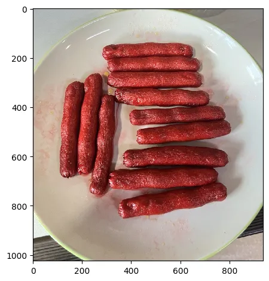
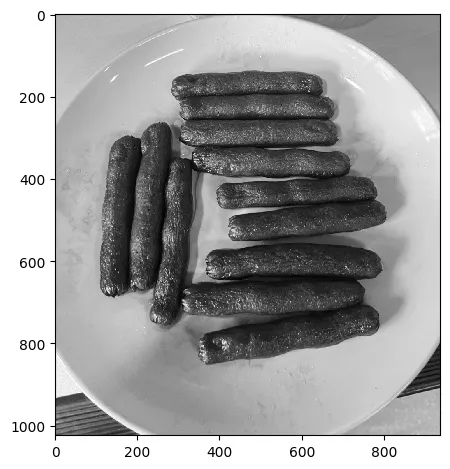

# 11.2 – Blob Detection

<video src="photo/BlobDetection.mp4" type="video/mp4" width="800" height="410" controls>
  Your browser does not support the video tag.
</video>

---
## 🔍 Overview
Blobs are regions in an image that differ in properties like brightness or color. Blob detection is used in applications such as motion tracking, object detection, and region labeling.

---

## 📐 Techniques and Math

Blob detection commonly uses:
- **Laplacian of Gaussian (LoG)**
- **Difference of Gaussian (DoG)**
- **Determinant of Hessian matrix**

### Laplacian of Gaussian (LoG)
```
LoG(x, y) = ∇²G(x, y) * I(x, y)
```
Where:
- `G(x, y)` is a Gaussian function
- `∇²` is the Laplacian operator
- `I(x, y)` is the image

---





## 🧪 Python(OpenCV) Example

```python
import cv2
import numpy as np

# Set up parameters for the Blob Detector
params = cv2.SimpleBlobDetector_Params()

# Filter blobs by area and set the minimum area for blobs to be detected
params.filterByArea = True
params.minArea = 100

# Create a blob detector using the specified parameters
detector = cv2.SimpleBlobDetector_create(params)

# Read the input image in grayscale
img = cv2.imread('blobs.png', cv2.IMREAD_GRAYSCALE)

# Detect keypoints (blobs) in the image
keypoints = detector.detect(img)

# Draw the detected keypoints (blobs) on the image
# Green color for blobs, and the option to draw detailed keypoint information
img_blobs = cv2.drawKeypoints(img, keypoints, np.array([]),
                              (0, 255, 0), cv2.DRAW_MATCHES_FLAGS_DRAW_RICH_KEYPOINTS)

# Save the image with detected blobs
cv2.imwrite('blob_result.png', img_blobs)

```

---

## 🧪 MATLAB Example

```matlab
% Read the image
img = imread('blobs.png');

% Convert the image to grayscale
gray = rgb2gray(img);

% Detect MSER (Maximally Stable Extremal Regions) features
points = detectMSERFeatures(gray);

% Display the original image
imshow(img);
hold on;

% Plot the MSER features
plot(points);

```

---

## 🖼️ Sample Image

- Blob Detection Result  


---

