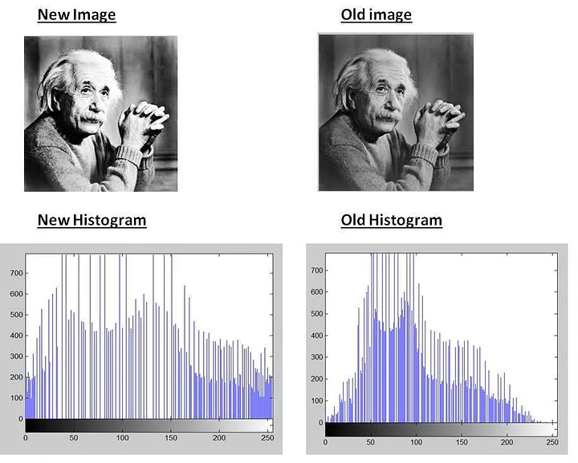

## 📊 2. Histogram Processing

📹 _Video_ 

---

### 🟡 A. Histogram Equalization

Histogram equalization is a technique used to improve the contrast of an image by redistributing the pixel intensities. It aims to create a uniform distribution of pixel values, enhancing details in both the dark and bright regions of the image. This method is particularly useful in images with poor contrast or uneven lighting.

#### 📘 Steps:
1. Compute histogram
2. Cumulative distribution
3. Normalize by `(L-1)/N`
4. Map new gray levels

#### 🐍 Python
```python

import cv2  # Import the OpenCV library for image processing

# Read the input image in grayscale mode (0 means read as grayscale)
img = cv2.imread('image.jpg', 0)

# Apply histogram equalization to enhance the contrast of the image
# This function improves the global contrast of the image by stretching the range of intensity values
equalized = cv2.equalizeHist(img)

```

#### 🧠 MATLAB
```matlab
% Read the input image from the file
img = imread('image.jpg');

% Apply histogram equalization to enhance the contrast of the image
% The histeq function improves the global contrast by redistributing the intensity values
eq_img = histeq(img);

% Display the histogram-equalized image in a new window
imshow(eq_img);

```


