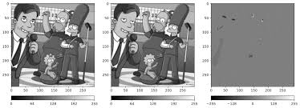
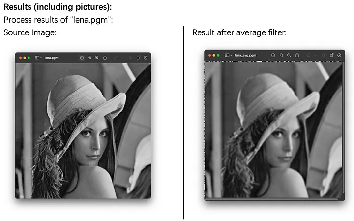

## 🧮 3. Arithmetic and Logical Operations

### ➖ Image Subtraction
Image subtraction involves subtracting one image from another, often used for detecting changes between two images or for highlighting specific features. The operation is performed by subtracting pixel values of one image from the corresponding pixel values of another image.

\[
g(x,y) = f(x,y) - h(x,y)
\]

---

#### Python Code ➖ Image Subtraction

```python
# Import the OpenCV library for image processing
import cv2  

# Read the two input images in grayscale mode
img1 = cv2.imread('image1.jpg', 0)  # First image
img2 = cv2.imread('image2.jpg', 0)  # Second image

# Ensure the images are of the same size
if img1.shape != img2.shape:
    raise ValueError("Images must be the same size for subtraction.")

# Perform image subtraction
subtracted_image = cv2.subtract(img1, img2)

# Display the result
cv2.imshow('Subtracted Image', subtracted_image)
cv2.waitKey(0)  # Wait for a key press to close the window
cv2.destroyAllWindows()  # Close all OpenCV windows

```
---
#### Matlab code ➖ Image Subtraction

```matlab
% Read the two input images
img1 = imread('image1.jpg');  % First image
img2 = imread('image2.jpg');  % Second image

% Ensure the images are of the same size
if size(img1) ~= size(img2)
    error('Images must be the same size for subtraction.');
end

% Perform image subtraction
subtracted_image = imsubtract(img1, img2);

% Display the result
imshow(subtracted_image);
title('Subtracted Image');

```




---

#### ➕ Image Averaging
Image averaging is a method of reducing noise by averaging multiple images. The resulting image is smoother, as random noise is canceled out by the averaging process.

\[
g(x,y) = \frac{1}{n} \sum_{i=1}^n g_i(x,y)
\]

---

#### Python Code ➕ Image Averaging

```python

import cv2  # Import the OpenCV library for image processing
import numpy as np  # Import NumPy for numerical operations

# Read the two input images in grayscale mode
img1 = cv2.imread('image1.jpg', 0)  # First image
img2 = cv2.imread('image2.jpg', 0)  # Second image

# Ensure the images are of the same size
if img1.shape != img2.shape:
    raise ValueError("Images must be the same size for averaging.")

# Perform image averaging
averaged_image = (img1.astype(np.float32) + img2.astype(np.float32)) / 2.0

# Convert back to uint8 format
averaged_image = np.uint8(averaged_image)

# Display the result
cv2.imshow('Averaged Image', averaged_image)
cv2.waitKey(0)  # Wait for a key press to close the window
cv2.destroyAllWindows()  # Close all OpenCV windows
```
---

#### Matlab code ➕ Image Averaging

```matlab
% Read the two input images
img1 = imread('image1.jpg');  % First image
img2 = imread('image2.jpg');  % Second image

% Ensure the images are of the same size
if size(img1) ~= size(img2)
    error('Images must be the same size for averaging.');
end

% Perform image averaging
averaged_image = (double(img1) + double(img2)) / 2;

% Convert back to uint8 format
averaged_image = uint8(averaged_image);

% Display the result
imshow(averaged_image);
title('Averaged Image');
```

---
