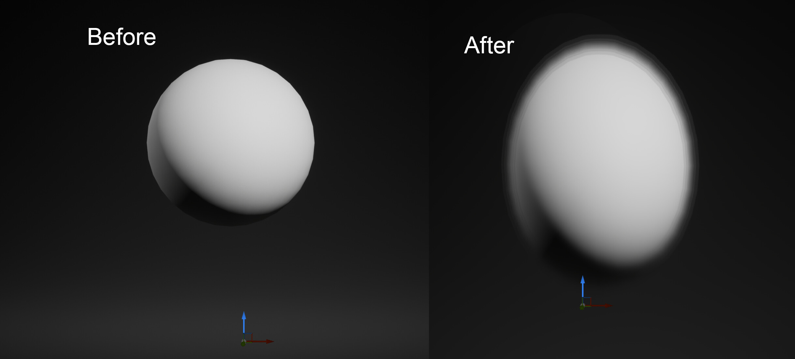
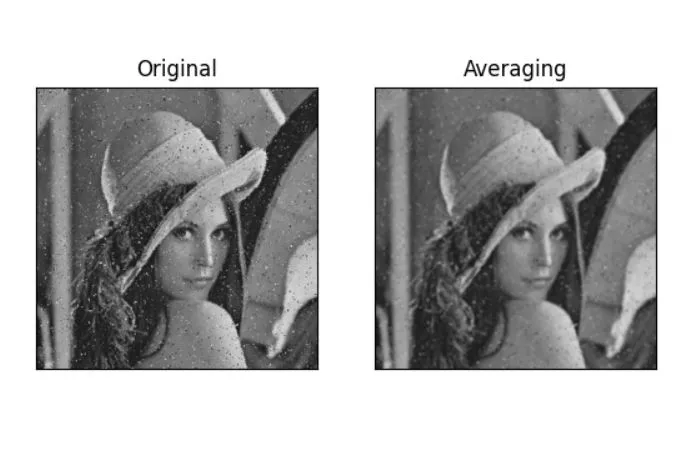

### 4.0 Introduction to Spatial Filtering

#### 🎥 Video
[Watch on YouTube](https://www.youtube.com/watch?v=8m-ZkOdv7VI)

### ✨ Overview

#### 🧹 A. Smoothing Filters

Smoothing filters are used to blur an image, reducing noise and detail. They work by averaging or smoothing the pixel values in a neighborhood of each pixel. Common types of smoothing filters include the median filter and the average filter.

#### 🧲 Mathematical Formula
\[
g(x, y) = \sum_{s=-a}^{a} \sum_{t=-b}^{b} w(s,t) \cdot f(x+s, y+t)
\]

### blurring (smoothing)

#### 🐍 Python (OpenCV)
```python
# Read the image and apply average blurring (smoothing)
import cv2
import numpy as np
img = cv2.imread('image.jpg')
blur = cv2.blur(img, (5, 5))  # Apply average filter of size 5x5
cv2.imshow("Smoothed Image", blur)
cv2.waitKey(0)
```

#### 🧠 MATLAB

```matlab
% Read image and apply average filter (smoothing)
img = imread('image.jpg');
smoothed = imfilter(img, fspecial('average', [5 5]));
imshow(smoothed);

```


#### 📸 Suggested Image


---

#### - Mean Filter (Average Filter)

The average filter, also known as the mean filter, is a linear smoothing filter that replaces each pixel’s value with the average of its neighboring pixel values. This filter helps reduce noise by smoothing out sharp variations in pixel intensity. However, it can blur edges and fine details in the image.

The average filter works by applying a kernel (a small matrix) over the image. The kernel is moved pixel by pixel, and the average of the pixel values covered by the kernel is calculated and assigned to the central pixel.


#### 🐍 Python
```python

# Import the OpenCV library for image processing
import cv2  
# Import NumPy for numerical operations
import numpy as np  

# Read the input image in grayscale mode
img = cv2.imread('image.jpg', 0)  # Read the image

# Create a 3x3 averaging kernel
# The kernel values are set to 1/9 to average the pixel values in a 3x3 neighborhood
kernel = np.ones((3, 3), np.float32) / 9

# Apply the averaging filter using the filter2D function
# The second argument -1 means the output image will have the same depth as the input image
avg = cv2.filter2D(img, -1, kernel)

# Display the original and averaged images
cv2.imshow('Original Image', img)
cv2.imshow('Averaged Image', avg)
cv2.waitKey(0)  # Wait for a key press to close the windows
cv2.destroyAllWindows()  # Close all OpenCV windows

```

#### 🧠 MATLAB

```matlab
% Read the input image
img = imread('image.jpg');

% Create a 3x3 averaging filter using fspecial
h = fspecial('average', [3 3]);

% Apply the averaging filter to the image using imfilter
avg = imfilter(img, h);

% Display the original and averaged images
figure;
subplot(1, 2, 1);
imshow(img);
title('Original Image');

subplot(1, 2, 2);
imshow(avg);
title('Averaged Image');
```

#### 📸 Suggested Image



---
#### Gaussian Smoothing Filter
Gaussian smoothing filters are effective for reducing noise in images while preserving edges better than other types of smoothing filters. They are widely used in various image processing applications, including preprocessing for edge detection and feature extraction

#### 🐍 Python Code for Gaussian Smoothing Filter

```python

import cv2  # Import the OpenCV library for image processing
import numpy as np  # Import NumPy for numerical operations
import matplotlib.pyplot as plt  # Import Matplotlib for plotting

# Read the input image
img = cv2.imread('image.jpg', cv2.IMREAD_GRAYSCALE)  # Read as grayscale

# Apply Gaussian smoothing using cv2.GaussianBlur
# The kernel size must be odd and positive; (5, 5) is a common choice
kernel_size = (5, 5)  # Size of the Gaussian kernel
sigma = 1.0  # Standard deviation for Gaussian kernel
smoothed = cv2.GaussianBlur(img, kernel_size, sigma)

# Display the original and smoothed images
plt.figure(figsize=(12, 6))
plt.subplot(1, 2, 1)
plt.imshow(img, cmap='gray')
plt.title('Original Image')
plt.axis('off')

plt.subplot(1, 2, 2)
plt.imshow(smoothed, cmap='gray')
plt.title('Gaussian Smoothed Image')
plt.axis('off')

plt.show()
```
---
#### 🧠 MATLAB Code for Gaussian Smoothing Filter

```matlab


% Read the input image
img = imread('image.jpg');
gray = rgb2gray(img);  % Convert to grayscale if it's a color image

% Create a Gaussian filter using fspecial
sigma = 1.0;  % Standard deviation for Gaussian kernel
kernel_size = 5;  % Size of the Gaussian kernel
h = fspecial('gaussian', [kernel_size kernel_size], sigma);

% Apply the Gaussian smoothing filter to the image
smoothed = imfilter(gray, h);

% Display the original and smoothed images
figure;
subplot(1, 2, 1);
imshow(gray);
title('Original Image');

subplot(1, 2, 2);
imshow(smoothed);
title('Gaussian Smoothed Image');
```
---
#### 📸 Suggested Image


---
