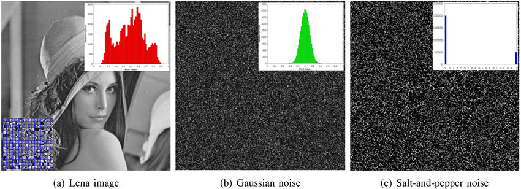

# 6.1 Noise Models (Gaussian, Salt & Pepper)

<video width="800" height="410" controls>
    <source src="photo/ImageRestorationMeanorAverageFilter.mp4" type="video/mp4">
    Your browser does not support the video tag.
  </video

---

## 📌 Introduction

In digital image processing, **noise** refers to random variations in brightness or color information in images, typically caused by sensor limitations or transmission errors. Understanding noise models is essential for restoration techniques.

### 🔍 Common Noise Types:
- **Gaussian Noise**: Normally distributed noise.
- **Salt & Pepper Noise**: Appears as randomly occurring white and black pixels.

---

## 📐 Mathematical Models

### ➕ Gaussian Noise:
The Gaussian distribution is defined by:

$$
P(x) = \frac{1}{\sqrt{2\pi\sigma^2}} e^{ -\frac{(x - \mu)^2}{2\sigma^2} }
$$

- \( \mu \): Mean (average value)
- \( \sigma \): Standard deviation (spread of noise)

### ⚫⚪ Salt & Pepper Noise:
This noise can be modeled as:

$$
P(x) = \begin{cases}
p & \text{for } x = 0 \ (\text{pepper}) \\
q & \text{for } x = 255 \ (\text{salt}) \\
1 - p - q & \text{for } x = \text{unchanged}
\end{cases}
$$

---

## 🐍 Python (OpenCV) Code

```python
import cv2
import numpy as np
import matplotlib.pyplot as plt

# Load grayscale image
img = cv2.imread('lena.png', 0)

# Add Gaussian noise
mean = 0
std = 25
gaussian = np.random.normal(mean, std, img.shape).astype(np.uint8)
noisy_gaussian = cv2.add(img, gaussian)

# Add Salt & Pepper noise
def add_salt_pepper(img, salt_prob, pepper_prob):
    noisy = img.copy()
    total_pixels = img.size
    # Salt
    num_salt = int(salt_prob * total_pixels)
    coords = [np.random.randint(0, i-1, num_salt) for i in img.shape]
    noisy[coords[0], coords[1]] = 255
    # Pepper
    num_pepper = int(pepper_prob * total_pixels)
    coords = [np.random.randint(0, i-1, num_pepper) for i in img.shape]
    noisy[coords[0], coords[1]] = 0
    return noisy

noisy_sp = add_salt_pepper(img, 0.02, 0.02)

# Display
plt.subplot(1,3,1), plt.imshow(img, cmap='gray'), plt.title("Original")
plt.subplot(1,3,2), plt.imshow(noisy_gaussian, cmap='gray'), plt.title("Gaussian Noise")
plt.subplot(1,3,3), plt.imshow(noisy_sp, cmap='gray'), plt.title("Salt & Pepper Noise")
plt.show()

```
---

### 🧮 MATLAB Code
```matlab
img = imread('lena.png');
gray = rgb2gray(img);

% Add Gaussian noise
noisy_gauss = imnoise(gray, 'gaussian', 0, 0.01);

% Add Salt & Pepper noise
noisy_sp = imnoise(gray, 'salt & pepper', 0.04);

% Display
figure;
subplot(1,3,1), imshow(gray), title('Original');
subplot(1,3,2), imshow(noisy_gauss), title('Gaussian Noise');
subplot(1,3,3), imshow(noisy_sp), title('Salt & Pepper Noise');


```


---


